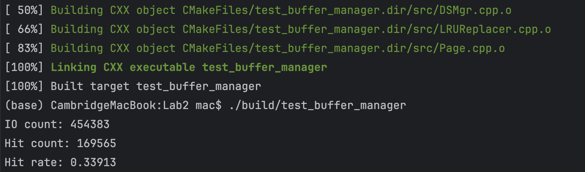

# Buffer Manager 设计和实现

## 设计及实现结果

### BCB( Buffer Control Block) 缓冲控制块 

```cpp
struct BCB{
    BCB():page_id(-1), frame_id(-1), latch(0), count(0), dirty(0), next(nullptr),LRU_next(nullptr),LRU_prev(nullptr){}
    BCB(int page_id, int frame_id, int count):page_id(page_id), frame_id(frame_id), latch(0), count(count), dirty(0), next(nullptr){}
    int page_id;
    int frame_id;
    int dirty;
    BCB* next; // 用于存储在哈希表当中

    // 用于存储在LRU 链表当中
    BCB* LRU_next;
    BCB* LRU_prev;
};
```
**BCB 当中包含的数据成员以及数据成员的功能**：
+ page_id: 用于存储页面的id
+ frame_id: 用于存储帧的id
+ dirty: 用于标记页面是否被修改,如果被修改则为1，否则为0
+ next: 用于存储下一个BCB的指针，这里的next指针用于实现哈希表（用于管理内存当中的BCB块的哈希表）中的链表的下一个BCB块
+ LRU_next & LRU_prev: 用于存储在LRU链表中的下一个BCB块和上一个BCB块,用于服务于页面替换算法LRU

### DSMgr(Data Storage Manager) 数据存储管理器

```cpp
class DSMgr{
public:
    explicit DSMgr();
    explicit DSMgr(string filename);
    ~DSMgr();
    // 打开指定的文件
    int OpenFile(string filename);
    // 关闭文件
    int CloseFile();

    // 创建新的页面
    page_id_t NewPage();

    // 读取指定的页面
    void ReadPage(page_id_t page_id, char* data);

    // 读取指定的页面
    shared_ptr<bFrame> ReadPage(int page_id);
    // 写入页面数据
    int WritePage(int frame_id, bFrame& frm);
    int WritePage(Page* page);
    // 移动文件指针
    int Seek(int offset, int pos);
    // 获取文件指针
    FILE* GetFile();

    // 增加页面计数
    inline void IncNumPages();

    // 获取页面计数
    inline int GetNumPages();

    // 设置页面使用位
    inline void SetUse(int index, int use_bit);

    // 获取页面使用位
    inline int GetUse(int index);

    inline static int getIOcount(){
        return IOcount;
    }
private:
    FILE* cuurentFile;
    int numPages;
    int pages[MAXPAGES];
    static int IOcount;
};
```

DSMgr类主要负责文件操作，其主要接口函数包括：
+ OpenFile(string filename)：打开指定文件。
+ CloseFile()：关闭当前使用的文件。
+ ReadPage(int page_id)：读取指定页面。
+ WritePage(int frame_id, bFrame frm)：写入页面数据。
+ Seek(int offset, int pos)：移动文件指针。
+ GetFile()：获取当前文件。
+ IncNumPages()：增加页面计数。
+ GetNumPages()：获取页面计数。
+ SetUse(int page_id, int use_bit)：设置页面的使用位。
+ GetUse(int page_id)：获取页面的使用位。
+ getIOcount(): 获取IO操作的次数
+ NewPage(): 创建新的页面
+ ReadPage(int page_id): 读取指定的页面
+ WritePage(int frame_id, bFrame& frm): 写入页面数据

#### ReadPage函数

```cpp
void DSMgr::ReadPage(page_id_t page_id, char* data){
    IOcount++;
    if(Seek(page_id * FRAMESIZE, SEEK_SET) != 0){
        cerr << "Seek Error" << endl;
        return;
    }
    if(fread(data, FRAMESIZE, 1, cuurentFile) != 1){
//        cerr << "ReadPage Error" << endl;
        return;
    }
}
```

ReadPage函数主要用于读取指定页面的数据，其实现过程如下：
1. 首先，将文件指针移动到指定页面的位置。
2. 然后，读取指定页面的数据。
3. 最后，将读取的数据存储到data中。

#### NewPage函数

```cpp
page_id_t DSMgr::NewPage(){
    bFrame frm;
    memset(frm.field, 0, FRAMESIZE);
    if(Seek(numPages * FRAMESIZE, SEEK_SET) != 0){
        cerr << "Seek Error" << endl;
        return -1;
    }
    if(fwrite(frm.field, FRAMESIZE, 1, cuurentFile) != 1){
        cerr << "WritePage Error" << endl;
        return -1;
    }
    IncNumPages();
    return numPages - 1;
}
```

NewPage函数主要用于创建新的页面，其实现过程如下：
1. 首先，创建一个新的页面。
2. 然后，将新的页面写入到文件中。
3. 最后，增加页面计数。
4. 返回新页面的id。
5. 如果创建页面失败，则返回-1。

#### WritePage函数

```cpp
int DSMgr::WritePage(int frame_id, bFrame& frm){
    IOcount++;
    if(Seek(frame_id * FRAMESIZE, SEEK_SET) != 0){
        cerr << "Seek Error" << endl;
        return -1;
    }
    if(fwrite(frm.field, FRAMESIZE, 1, cuurentFile) != 1){
        cerr << "WritePage Error" << endl;
        return -1;
    }
    return 0;
}
```

WritePage函数主要用于写入页面数据，其实现过程如下：
1. 首先，将文件指针移动到指定页面的位置。
2. 然后，将页面数据写入到文件中。
3. 如果写入成功，则返回0，否则返回-1。

### BMgr(Buffer Manager) 缓冲管理器

#### BCB* ptof[DEFBUFSIZE] 数组
采用Hash表的方式对于BCB进行管理，通过page_id来找到存储BCB的哈希表当中的位置，其中frame_id_t Hash(int page_id)函数用于计算page_id对应的哈希表的位置。

哈希表采用了拉链法解决冲突，即通过page_id找到对应的BCB，然后在BCB当中的next指针找到下一个BCB，直到找到对应的BCB。

#### LRU_head & LRU_tail 
LRU_head & LRU_tail 用于记录LRU链表的头和尾，用于实现LRU算法。这里管理的是一个双向链表，用于记录最近访问的页面。为了实现此双向链表之前在设计BCB的数据结构的时候，添加了LRU_next和LRU_prev两个指针。

#### int ftop[DEFBUFSIZE] 数组
用于记录内存当中的每个frame当中保存的page_id，通过frame_id来找到对应的page_id。

#### ReMoveToTheTailOfLRUList(BCB* ptr) 函数
```cpp
void BMgr::ReMoveToTheTailOfLRUList(BCB *ptr) {
    // 将当前指针指向的BCB移动到LRU链表的尾部
    if(LRU_head == ptr && LRU_tail == ptr){
        return ;
    }
    else if(LRU_head == ptr){
        LRU_head = ptr->LRU_next;
        ptr->LRU_next = nullptr;
        ptr->LRU_prev = LRU_tail;
        LRU_tail->LRU_next = ptr;
        LRU_tail = ptr;
    }
    else if(LRU_tail == ptr){
        return ;
    }
    else{
        ptr->LRU_prev->LRU_next = ptr->LRU_next;
        ptr->LRU_next->LRU_prev = ptr->LRU_prev;
        ptr->LRU_next = nullptr;
        ptr->LRU_prev = LRU_tail;
        LRU_tail->LRU_next = ptr;
        LRU_tail = ptr;
    }
}
```

ReMoveToTheTailOfLRUList函数用于将当前指针指向的BCB移动到LRU链表的尾部，其实现过程如下：
1. 首先，判断当前指针指向的BCB是否是LRU链表的头和尾，如果是，则直接返回。
2. 然后，判断当前指针指向的BCB是否是LRU链表的头，如果是，则将LRU_head指向当前BCB的下一个BCB。
3. 然后，判断当前指针指向的BCB是否是LRU链表的尾，如果是，则直接返回。
4. 最后，将当前指针指向的BCB移动到LRU链表的尾部。

#### insertToTheTailOfLRUList(BCB* ptr) 函数
```cpp
BCB* BMgr::insertToTheTailOfLRUList(BCB *ptr) {
    // 插入到LRU链表的尾部
    if(LRU_head == nullptr){
        LRU_head = ptr;
        LRU_tail = ptr;
    }
    else{
        LRU_tail->LRU_next = ptr;
        ptr->LRU_prev = LRU_tail;
        LRU_tail = ptr;
    }
    return ptr;
}
```
insertToTheTailOfLRUList函数用于将当前指针指向的BCB插入到LRU链表的尾部，其实现过程如下：
1. 首先，判断LRU链表是否为空，如果为空，则将LRU_head和LRU_tail都指向当前BCB。
2. 然后，将当前BCB插入到LRU链表的尾部。
3. 最后，返回当前BCB。

#### selectVictim() 函数
```cpp
frame_id_t BMgr::SelectVictim() {
    if(LRU_head == nullptr){
        return -1;
    }
    BCB* ptr = this->LRU_head;
    int ret = ptr->frame_id;
    if(ptr->dirty){
        // 处理写过的脏的页面
        dsMgr->WritePage(ptr->frame_id, frame[ptr->frame_id]);
    }
    LRU_head = ptr->LRU_next;
    return ret;
}
```
由于本程序当中采用LRU算法进行页面替换，因此选取需要换出去的页面的时候，直接选取LRU链表的头部的BCB即可。在选取换出的同时，将LRU链表的头部的BCB移除。这里的移除只是从LRU链表当中移除，并没有从哈希表当中移除。后续在从哈希表当中移除之后将释放相应的内存。

#### deleteBCBFromPTOF(int frame_id) 函数
```cpp
bool BMgr::deleteBCBFromPTOF(int frame_id) {
    int Old_page_id = ftop[frame_id];
    ftop[frame_id] = -1;
    int Old_hash_id = hash(Old_page_id);
    BCB *p = ptof[Old_hash_id];

    if(p->frame_id == frame_id){
        // 要删除的节点在链表的开头
        ptof[Old_hash_id] = p->next;
        delete p;
        return true;
    }
    else{
        while(p->next != nullptr){
            if(p->next->frame_id == frame_id){
                BCB* tmp = p->next;
                p->next = tmp->next;
                delete tmp;
                return true;
            }
            p = p->next;
        }
    }
    // 没有找到要删除的节点
    return false;
}
```
deleteBCBFromPTOF函数用于删除指定frame_id的BCB，由于之前在selectVictim当中完成了对应的块从LRU链表当中移除这里也需要完成对于内存空间的释放，其实现过程如下：
1. 首先，获取frame_id对应的page_id。
2. 然后，获取page_id对应的哈希表的位置。
3. 然后，遍历哈希表，找到要删除的BCB。
4. 最后，删除要删除的BCB。
5. 如果找到要删除的BCB，则返回true，否则返回false。
6. 删除BCB之后，需要释放相应的内存。
7. 删除BCB之后，需要将frame_id对应的page_id设置为-1。

#### FixPage

因为逻辑相关的问题，我的FixPage整合了设计文档当中FixPage,FixNewPage以及UnfixPage的功能，为BMgr当中名副其实的核心函数，但是这样设计明显导致功能的耦合性过高，不是很利于维护，唯一的好处可能是我自己写下来的时候逻辑更为清晰，更有一气呵成的感觉。

FixPage函数要求传入页面的page_id，在传入page_id之后通过hash函数计算出对应页面在哈希表的位置。遍历相应的散列链表，如果找到了对应的BCB，则直接返回相应的frame_id，同时调整LRU链表，将对应的BCB调整到LRU链表的最后。

如果没有找到page_id这个时候首先检查是否分配的缓存块已经达到了buffer的最大的容量，如果没有达到，则直接分配新的块，并在分配块的同时将相应的BCB加入到LRU链表当中。同时完成将内容读入内存当中的工作。

如果这个时候已经没有多余的frame了，则在这个时候用SelectVictim函数选取替换出来的frame，并将这个frame对应的BCB从哈希表当中删除，同时将新的页面对应的BCB写入其中。也完成内存读入内存的工作。

### 主函数设计

由于测试的记录有50000条记录，因此为了保证数据库的大小足够所有的查询，因此在本程序执行开始先构建一个大小为 50000*PAGE_SIZE的文件test.dbf，我在运行之后得到了大小为204.8MB的test.dbf文件。随后扫描data-5w-50w-zipf.txt 文件，对相应的页面进行读写操作。


## 运行结果

运行得到本程序进行IO的次数为454383次,在运行的过程当中命中169565次，命中率为0.33913




