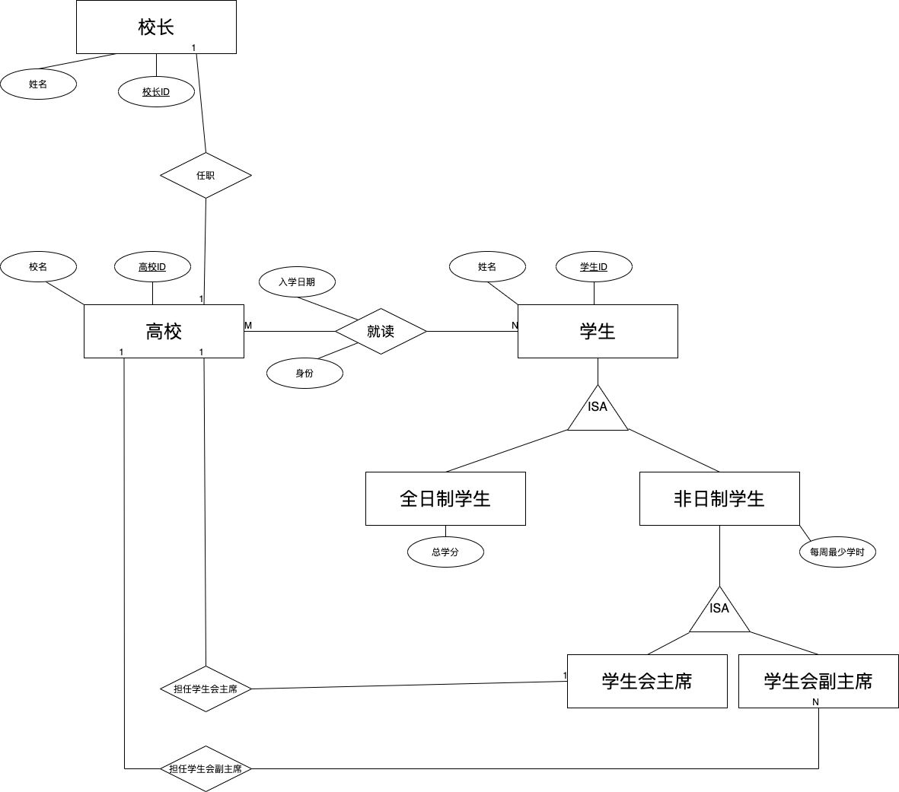

# Homework#1

1.
（1） 查询姓名当中含有“科”字的学生学号和姓名

```mysql
SELECT sno,sname FROM Student WHERE sname LIKE '%科%';
```

（2）查询学分不低于3分的必修课的课程号和课程名

```mysql
SELECT cno,cname
FROM Course
WHERE credit>1 AND type = 0;
```

（3）查询选了公选课但是缺少成绩的学生学号和姓名

```mysql
SELECT DISTINCT sno,sname 
FROM Student 
WHERE sno 
IN (SELECT sno FROM SC WHERE score IS NULL AND cno IN
   (
     SELECT cno FROM Course WHERE type = 3
   )
 );
```

（4） 查询已选必修课总学分大于 16 并且所选通识课成绩都大于 75 分的学生姓名

```mysql
SELECT s.sname
FROM Student s
JOIN (
    SELECT sc.sno
    FROM SC sc
    JOIN Course c ON sc.cno = c.cno
    WHERE c.type = 0
    GROUP BY sc.sno
    HAVING SUM(c.credit) > 16
) AS required_courses ON s.sno = required_courses.sno
WHERE NOT EXISTS (
    SELECT *
    FROM SC sc2
    JOIN Course c2 ON sc2.cno = c2.cno
    WHERE sc2.sno = s.sno
      AND c2.type = 2
      AND sc2.score <= 75
);

```

（5）查询已经修完所有必修课且成绩合格的学生学号和姓名

```mysql
SELECT s.sno, s.sname
FROM Student s
WHERE NOT EXISTS (
    SELECT c.cno
    FROM Course c
    WHERE c.type = 0  
    AND NOT EXISTS (
        SELECT sc.cno
        FROM SC sc
        WHERE sc.sno = s.sno
        AND sc.cno = c.cno 
        AND sc.score >= 60 
    )
);

```

---------


2. 

```mysql
SELECT T.D
FROM R 
JOIN S ON R.B = S.B
JOIN T ON S.C = T.C
WHERE p(R.A) AND q(R.B) AND m(S.C);
```

----
3. 

（1） 求出F的最小依赖集
$$
F = \{A\rightarrow BC, B\rightarrow CE, A\rightarrow B, AB\rightarrow C, AC\rightarrow DE, E\rightarrow A \}
$$
经过分解可以得到

$$
F = \{A\rightarrow B,A\rightarrow C, B\rightarrow C, B\rightarrow E, AB\rightarrow C, AC\rightarrow D,AC\rightarrow E, E\rightarrow A \}
$$
消除左部冗余属性可得
$$
F = \{A\rightarrow B,A\rightarrow C, B\rightarrow C, B\rightarrow E, E\rightarrow A , A\rightarrow D\}
$$

消除冗余依赖可以得到

$$
F = \{A\rightarrow B, B\rightarrow C, B\rightarrow E,  E\rightarrow A, A\rightarrow D \}
$$

（2）求出R的候选码
候选码为 {A}
（3）R属于第二范式，A 作为主属性，其他属性都完全依赖于主键，不存在部分依赖，但是都存在传递依赖的问题，因此不是3NF
（4） 将R无损的分解为3NF
R(A,B,C,D,E) 根据最小依赖集按照左边相同进行分解得到
R1 (A,B,D), R2(B,C,E), R3(E,A)
可以得到 q = { R1 (A,B,D), R2(B,C,E), R3(E,A) }
A为码，则有 p = q$\cup$R(A) =   { R1 (A,B,D), R2(B,C,E), R3(E,A) }

-----

4.
$$
F = \{ AB\rightarrow E, A\rightarrow B, B\rightarrow C,C\rightarrow D \}
$$
分解得到最小依赖集为
$$
F = \{ A\to E, A\to B, B\rightarrow C,C\rightarrow D \}
$$
主键为 {A,F}

（1） 当前的模式满足第几范式，为什么？

当前的关系模式满足第一范式

+ 第一范式：各个属性的值都是原子值，因此满足第一范式
+ 第二范式：所有的非主属性并不是完全依赖于主属性，有大量的部分依赖存在，因此不满足第二范式
+ 第三范式： 所有的非主属性并不直接依赖于主属性，因此不满足第三范式

（2）将关系模式R无损的分解到BCNF

p = {R(A,B,C,D,E,F)}

首先分解为第二范式 p = { R1(A,E,B,C,D),R2(A,F) }

在将R分解为BCNF之前先将R分解为3NF

根据最小依赖集按照左边相同进行分解可以得到

p = { R1(A,E,B), R2(B,C), R3(C,D) ,R4(A,F) }

此时满足BCNF，因此可以得到 p = { R1(A,E,B), R2(B,C), R3(C,D) ,R4(A,F) }

------

5. 

（1） 根据需求画出ER图



（2） 将ER模型转化为关系模型

将概念模型当中的实体转化为关系模式可以得到下面的

+ 高校（<u>高校ID</u>，校名，校长ID）
+ 校长（<u>校长ID</u>，姓名）
+ 学生（<u>学生ID</u>，姓名）
+ 全日制学生（<u>学生ID</u>，总学分）
+ 非全日制学生（<u>学生ID</u>，每周最小学时）
+ 学生会主席（<u>学生ID</u>，高校ID）
+ 学生会副主席（<u>学生ID</u>，高校ID）
+ 就读（<u>学生ID</u>，<u>高校ID</u>，身份，入学时间）