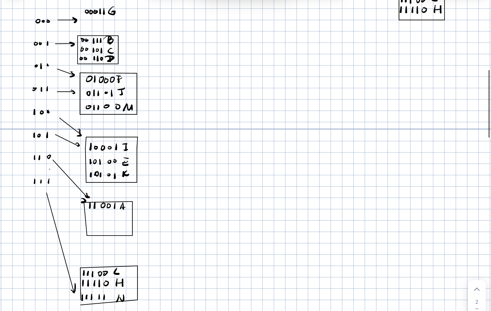

# Homework4

1.

1）B+树索引对“查询 title 中同时包含给定关键词的文献”未必有效。

原因：

1. B+树索引在范围查询和前缀匹配时表现较好，但对于“多个关键词同时存在”的查询，需要对关键词进行布尔逻辑判断，而 B+树不支持这种查询的直接优化。
2. 若使用 B+树索引，通常只能索引一个关键词或组合字段，复杂查询可能仍需要全表扫描或过滤，效率未必高。

2）

优化思路：

+ 使用支持重复键值的辅助索引，存储每个关键词到包含该关键词的文献 ID 的映射关系。
+ 索引结构如图所示：

```
关键词     文献 ID
-----------------
keyword1  [1, 3, 7]
keyword2  [2, 5, 8]
keyword3  [1, 4]
```

插入过程：

1. 将文献的 title 分词，提取关键词。
2. 对于每个关键词，检查倒排索引：	
	+ 若关键词已存在，追加文献 ID；
	+ 若关键词不存在，新增记录。

查询过程：
1. 将查询的关键词分词，查找对应的文献 ID 列表。
2. 对所有关键词的文献 ID 列表取交集，得到满足条件的文献。

----

2.

1)最终有6个桶，最终E所在桶当中的值为EIK，插入的过程如下面所示




2）最终一共有5个桶，B所在的桶还有的关键字有BGNK


----

3. 

由表中给出的信息可以得出每一次读磁盘需要的时间为 $S+T+R$

由于每个节点当中最多存储2n个键值和2n+1个指针，则树的高度为$\lceil log_{2n}N\rceil$

由于树高为$\lceil log_{2n}N \rceil$,则可以得到在查找的过程当中访问磁盘需要用掉的时间为$\lceil log_{2n}N \rceil(S+T+R)$,

在每个磁盘块当中查找一条记录需要的时间为2n则最终总的用时为$2n\lceil log_{2n}N \rceil$

在读取的过程当中每次读取2n个压缩值，因此解压的时候每次需要用时2n*c

最终可以得到总的用时为$\lceil log_{2n}N \rceil(S+T+R+2n*c+2n)$